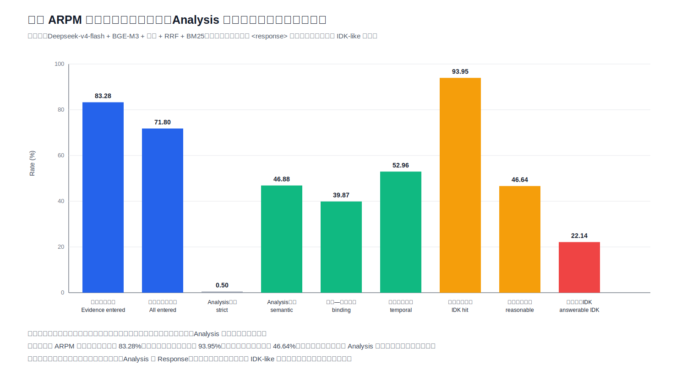

# LOCOMO full ARPM result

Evaluation size: 1,986 QA records.

Standard metrics: Hit@5 60.93%, Hit@10 71.75%, MRR 48.24%, EM 12.64%, F1 31.93%.

White-box metrics: evidence entered prompt rate 83.28%, all evidence entered prompt rate 71.80%, semantic analysis hit rate 46.88%, answer-evidence binding rate 39.87%, temporal reasoning correctness 52.96%, official unanswerable hit rate 93.95%, white-box reasonable abstention rate 46.64%, answerable-question abstention rate 22.14%.

